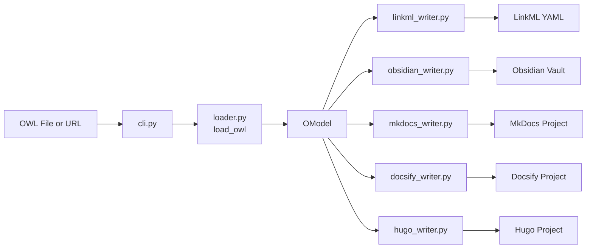
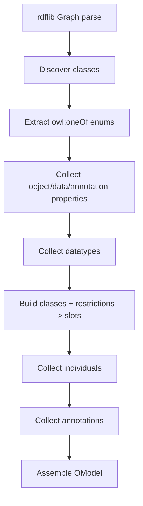

# Architecture

## High-Level Flow

## Module Responsibilities

- `owl2vault/cli.py`: argument parsing, URL download support, orchestration.
- `owl2vault/loader.py`: OWL parsing and extraction into `OModel`.
- `owl2vault/model.py`: dataclasses used by all renderers.
- `owl2vault/linkml_writer.py`: LinkML schema generation.
- `owl2vault/obsidian_writer.py`: Obsidian markdown + front matter generation.
- `owl2vault/mkdocs_writer.py`: MkDocs markdown content + `mkdocs.yml` in output targets.
- `owl2vault/docsify_writer.py`: Docsify wrapper around shared markdown generation.
- `owl2vault/hugo_writer.py`: Hugo content + `hugo.toml`, relref rewriting, front matter.

## Loader Extraction Pipeline

## Writer Reuse Strategy

`mkdocs_writer._write_markdown_docs` is the shared markdown backbone used by:

- MkDocs output directly
- Docsify output (`README.md` home + `_sidebar.md`)
- Hugo output (`_index.md` home + post-processing for front matter/relref)

This keeps entity-page structure and link targets consistent across static-site outputs.
