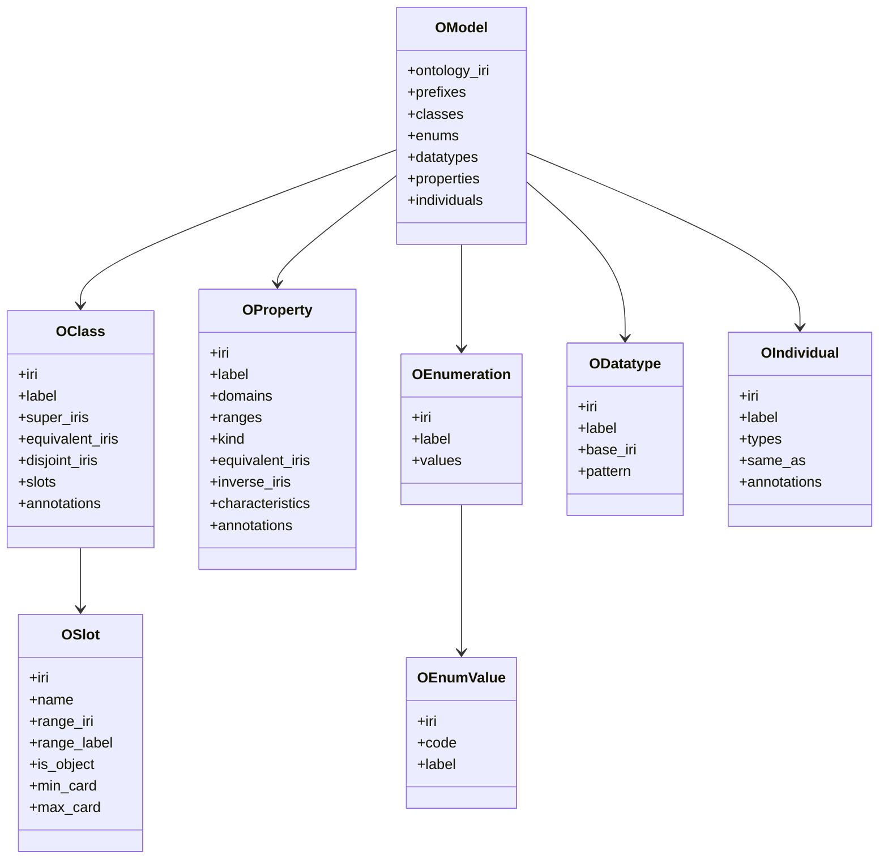

# Data Model

The intermediate model (`OModel`) is defined in `owl2vault/model.py` and acts as the contract between parsing and rendering.

## Core Entities

- `OModel`
- `OClass`
- `OSlot`
- `OProperty`
- `OEnumeration`
- `OEnumValue`
- `ODatatype`
- `OIndividual`

## Relationship Overview

## Notes

- Annotation values are modeled as `(value, is_iri)` tuples so writers can render either literal text or links.
- Writer modules use IRI-derived stable note/page IDs from `owl2vault/note_id.py`.
